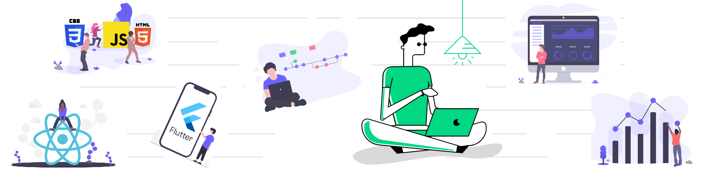

## **About Me**

Hello there! :wave:.

My name is **{{ site.author.name }}**. I am a Research Informatician and a Software Developer (:desktop_computer: and :iphone:) working at Institute of Environmental Science & Research (ESR) in Christchurch, New Zealand :new_zealand:. My current work is focused in public health and environment sciences.

I have a strong passion for technology. I blog mostly about Web development and Data Science in general. Python and R are my go to tools for exploratory data analysis (EDA), statistics and machine learning. I blog and pin them in chronological order in "Blog" tab. The toolset I currently use - Python, R, Jupyter notebooks, RShiny, SQL (SQL Server, Postgres, MySQL), NoSQL (MongoDB), Flask, Django, React JS, Git & GitHub, Docker, Kubernetes, Azure, Azure DevOps, PowerBI, Tableau for my day to day tasks and other workflow tools.

A list of my projects are under the Projects tab. You may also check out my GitHub profile.

To get a better insight on my career so far, check out my curriculum vitae (CV tab).

Feel free to read a bit more about me down below.





    

        

            <h6 class=" text-uppercase"></h6>
            

        

    

    <h3>💼 Work Experience 💼</h3>

    

